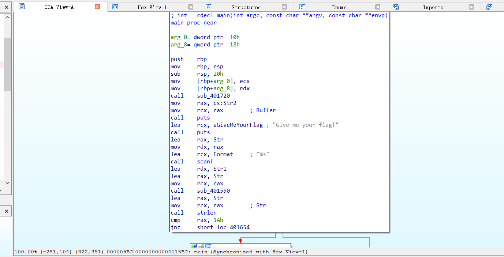
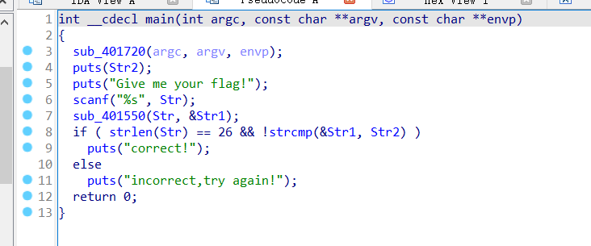
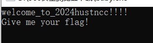
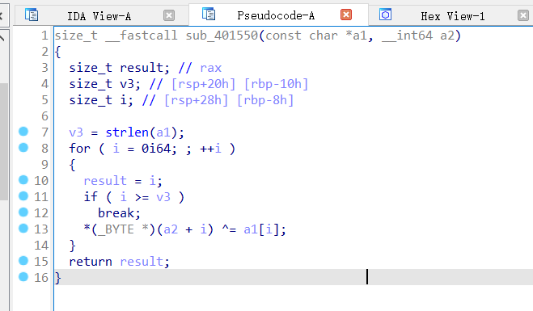
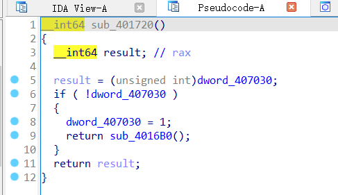
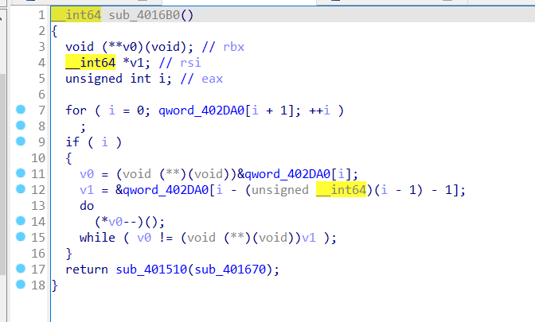
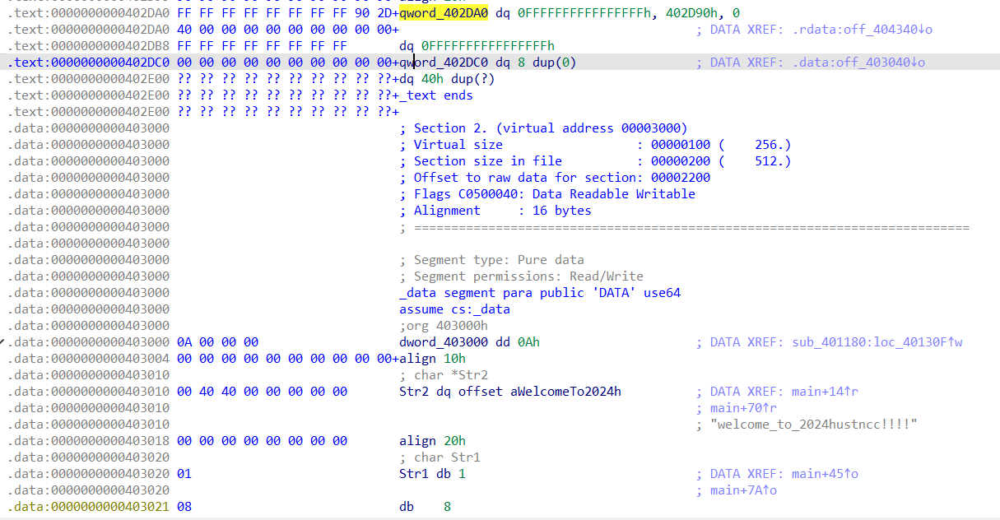
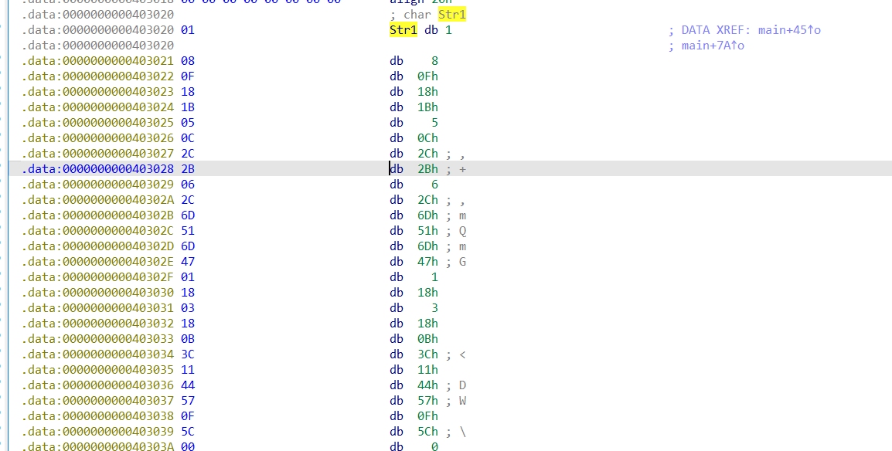

# Reverse-静态分析

## 题意
给了一个`baby.exe`文件，要求进行逆向分析。

## 题解
利用ida64打开文件后，按F5进行反编译


反编译后，发现要求输入一个长度为26的字符串Str，然后对Str操作一下存到Str1中，还要和Str2进行比较，那么运行一下baby.exe看看Str2到底是什么


拿到Str2以后，看一下sub_401550会对我们输入的Str做什么操作


在sub_401550中，Str1的每一位会和Str进行异或，那么我们要确定Str1是什么


在sub_401720中，点进sub_4016B0


在sub_4016B0中，我们再看一下qword_402DA0


在qword_402DA0下方，我们看到了存储Str1和Str2的地方



我们也就拿到了Str1的原始值是什么，然后编写代码把Str1和Str2按位异或起来就是我们要输入的Str，即flag。
```cpp
    vector<unsigned int> a = {0x01, 0x08, 0x0F, 0x18, 0x1B
        , 0x05, 0x0C, 0x2C, 0x2B, 0x06, 0x2C, 0x6D, 0x51, 0x6D, 0x47
        ,0x01, 0x18, 0x03, 0x18, 0x0B, 0x3C, 0x11, 0x44, 0x57, 0x0F, 0x5C};
    string str1 = "";
    for (auto x : a) {
        str1.push_back(char(x));
    }
    string str2 = "welcome_to_2024hustncc!!!!";
    for (int i = 0; i < str1.size(); i++) {
        cout << char(str1[i] ^ str2[i]);
    }
```
