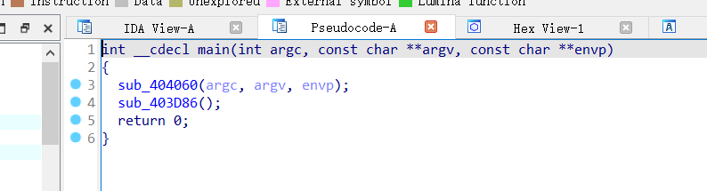
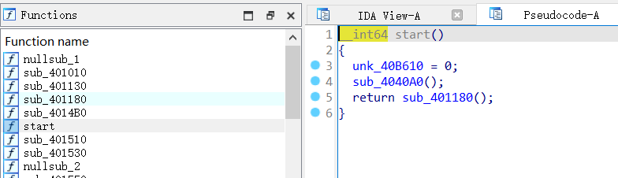
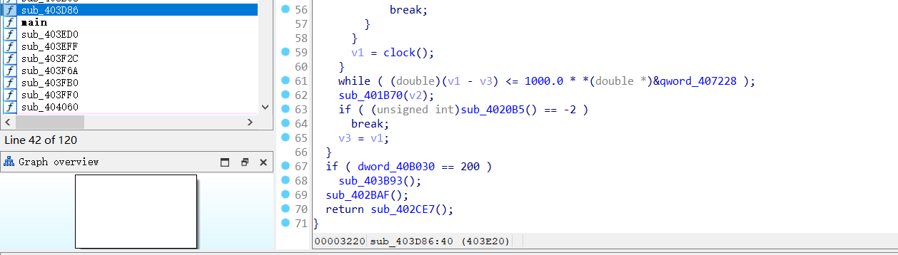
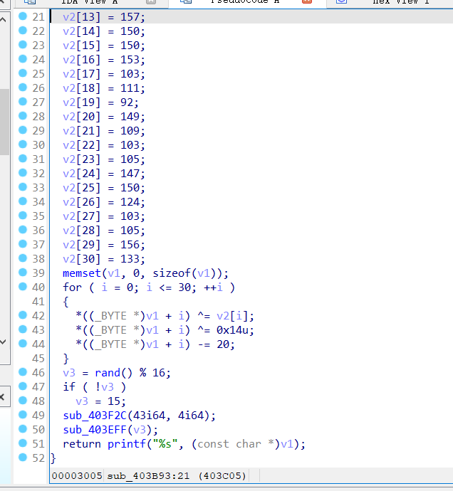
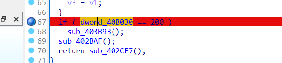
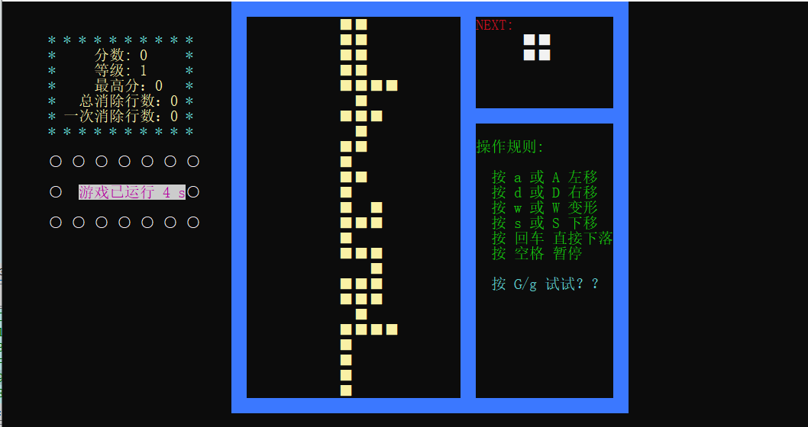
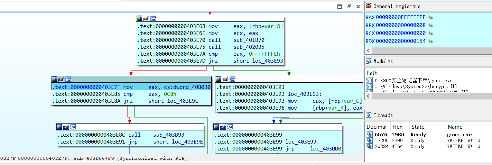
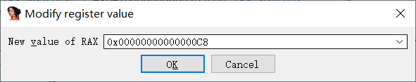
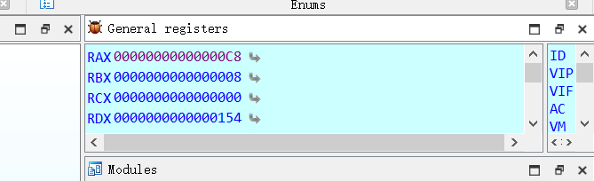
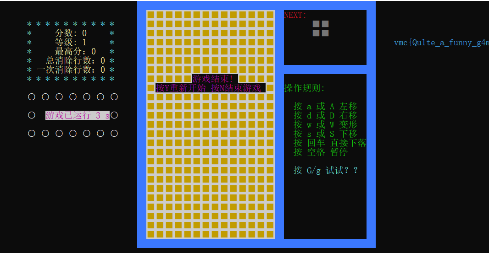

# Reverse-动态调试

## 题意
给了一个`game.exe`文件，要求进行逆向分析。点开一看是俄罗斯方块，~~做不出来也可以玩一玩~~。

## 题解
利用ida64打开game.exe文件，按F5进行反汇编

在左侧Functions中，有一个start，我们从start开始看

可疑点在sub_403D86，其中存在一个判断语句，判断dword_40B030是否等于200，然后会跳入sub_403B93

在sub_403B93当中，函数最后会进行打印，有可能就是flag

那么我们在条件判断语句那打上断点，然后执行程序，选择Local Windows debugger，快速进行到断点位置

根据汇编代码，我们发现dword_40B030的值会存到eax寄存器当中，然后和0xC8进行比较，那么此时我们需要做的就是提前修改好eax的值

然后按F8单步执行程序到判断之前

在右上角General registers中找到RAX，修改它的值为0xC8

然后按F9执行程序，此时我们会在程序窗口看见右侧打印出了我们要的flag

