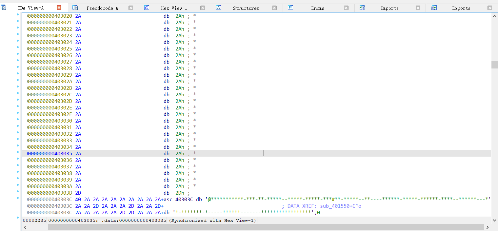
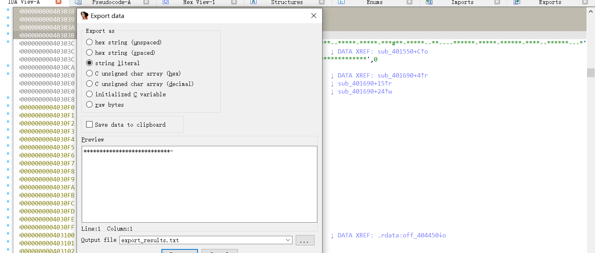
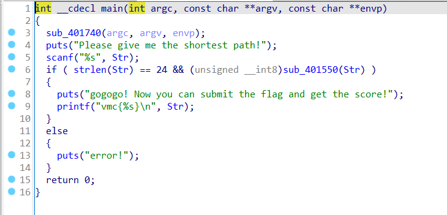
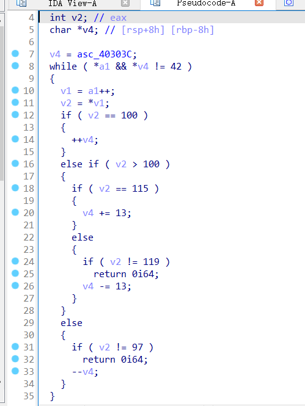
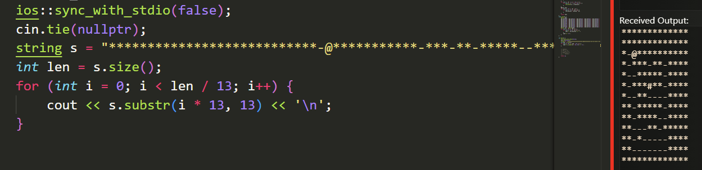
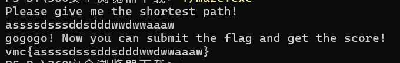

# Reverse-迷宫逆向

## 题意
给出一个`maze.exe`，要求进行逆向分析

## 题解
打开maze.exe发现要输入一条迷宫路径，直接用ida64打开文件，找到迷宫数据的位置


选定数据段然后按shift+E导出数据，得到迷宫的样子，但还需要确定迷宫的行和列


按F5反编译，然后查看sub_401550


通过查看函数，发现如果当v2=='s'时v4+=13，v2==‘w'时v4-=13，所以可以确定1行有13列，
`w`就是往上走，`s`就是往下走，`a`是往左走，`d`是往右走


通过编译代码，查看迷宫的样子
```cpp
    string s = "***************************-@***********-***-**-*****--*****-*****-***#**-*****--**----******-*****-******-****--******---**-*******-*-----******-------*****************";
    int len = s.size();
    for (int i = 0; i < len / 13; i++) {
        cout << s.substr(i * 13, 13) << '\n';
    }
```


看着迷宫，其中`@`是起始位置，`#`是结束位置，`*`是墙，`-`是空白格，那么手玩一下就知道最短路径

