# Reverse-语言特性

## 题意
给你一个`stl.exe`文件，要求你进行逆向分析得到flag

## 题解
首先利用ida64打开stl.exe文件
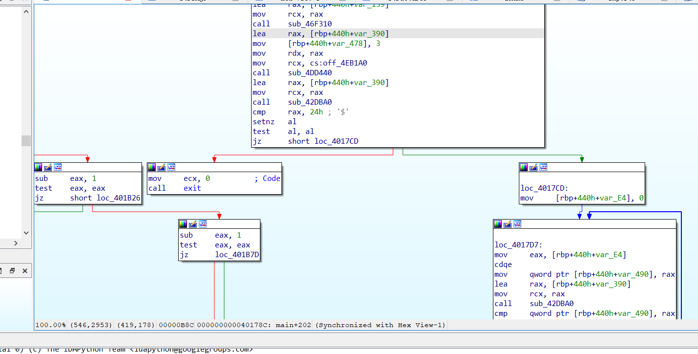

然后按shift+F12找到String窗口，发现其中一行是you find it, flag is vmc{
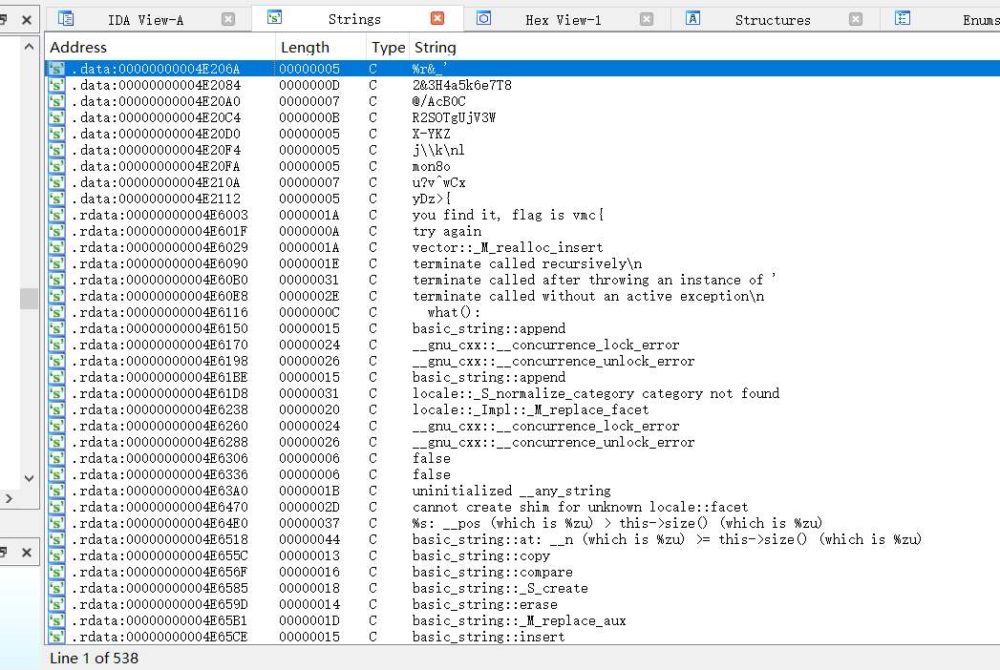

直接定位到这个函数
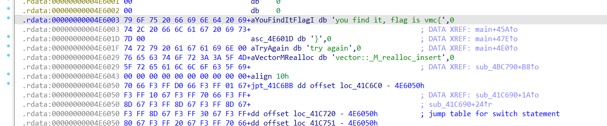
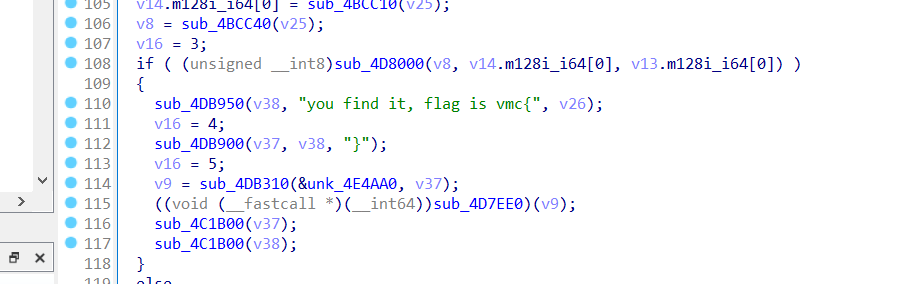

在第79和第80行我们可以看到，我们输入的字符串应该是存到了v26地址下，然后输入的长度必须是36
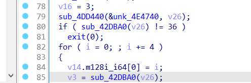

然后看到第70行至第72行，这段代码主要是在进行一个拷贝，把unk_4E2020地址的256字节拷贝到v29，然后v14指向v29首地址，(v14+1)的值是256
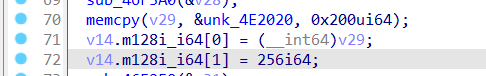
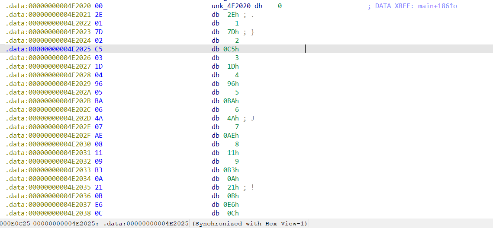

然后把这256个数据导出，其中奇数位(base 1)为数据，偶数位为序号
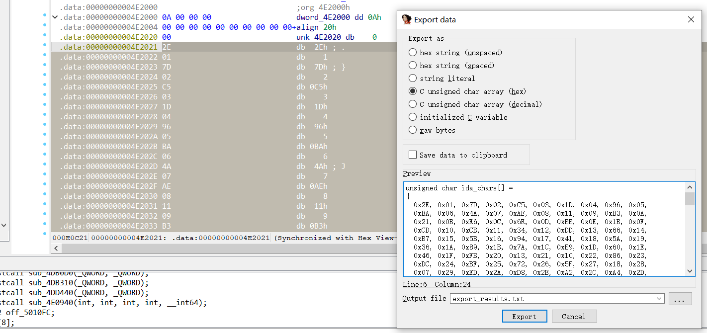

我们再看一下v27存储的是什么，并询问一下号称宇宙最强Gemini3，发现这些代码似乎在做一个类似于c数组初始化存值的事情
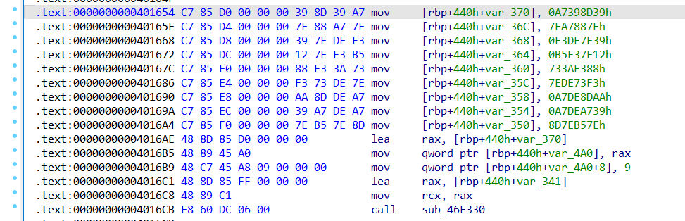
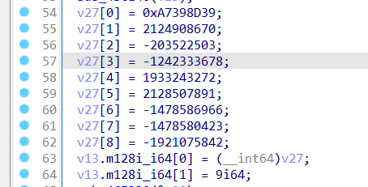

在for循环语句中，对于我们的输入进行四个一分组进行后续操作
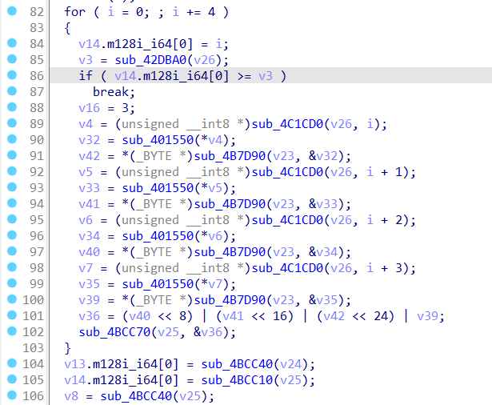

查看sub_4C1CD0，像是一个数组取地址的模样，*a1是首地址，a2就是偏移量
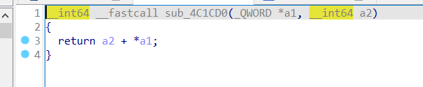

再看sub_401550，这里先是a1乘16，然后或上一个a1除4，因为a1是int8类型，那么也就是高4位和低4位互换位置然后取反的一个操作
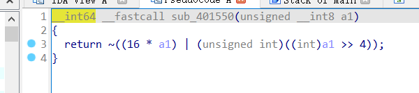

再看sub_4B7D90，我们再让Gemini分析一下，发现是一个类似映射的结构
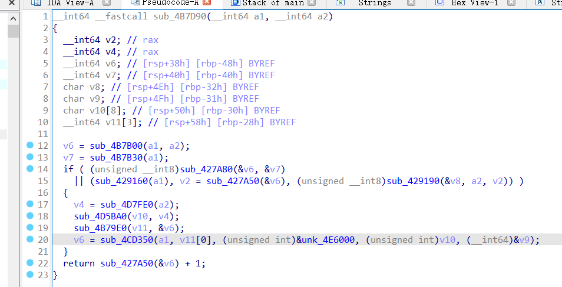

根据以上分析，我们大概可以复现出原始的c代码
```cpp
unsigned char m[] =
{
  0x2E, 0x01, 0x7D, 0x02, 0xC5, 0x03, 0x1D, 0x04, 0x96, 0x05, 
  0xBA, 0x06, 0x4A, 0x07, 0xAE, 0x08, 0x11, 0x09, 0xB3, 0x0A, 
  0x21, 0x0B, 0xE6, 0x0C, 0x6E, 0x0D, 0xBB, 0x0E, 0x1B, 0x0F, 
  0xCD, 0x10, 0xCB, 0x11, 0x34, 0x12, 0xDD, 0x13, 0x66, 0x14, 
  0xB7, 0x15, 0x5B, 0x16, 0x94, 0x17, 0x41, 0x18, 0x5A, 0x19, 
  0x36, 0x1A, 0x89, 0x1B, 0x7A, 0x1C, 0xE9, 0x1D, 0x60, 0x1E, 
  0x46, 0x1F, 0xFB, 0x20, 0x13, 0x21, 0x10, 0x22, 0x86, 0x23, 
  0xDC, 0x24, 0xBF, 0x25, 0x72, 0x26, 0x5F, 0x27, 0x18, 0x28, 
  0x07, 0x29, 0xED, 0x2A, 0xD8, 0x2B, 0xA2, 0x2C, 0xA4, 0x2D, 
  0xF3, 0x2E, 0x19, 0x2F, 0x20, 0x30, 0xF2, 0x31, 0xA9, 0x32, 
  0x26, 0x33, 0x48, 0x34, 0x61, 0x35, 0x6B, 0x36, 0x65, 0x37, 
  0x54, 0x38, 0xEA, 0x39, 0xD4, 0x3A, 0xE1, 0x3B, 0x05, 0x3C, 
  0x0C, 0x3D, 0x2B, 0x3E, 0x0E, 0x3F, 0xB0, 0x40, 0x2F, 0x41, 
  0x63, 0x42, 0x30, 0x43, 0xC7, 0x44, 0x55, 0x45, 0xD2, 0x46, 
  0x85, 0x47, 0x52, 0x48, 0xD6, 0x49, 0xE4, 0x4A, 0x9C, 0x4B, 
  0x8B, 0x4C, 0x00, 0x4D, 0x17, 0x4E, 0x91, 0x4F, 0x28, 0x50, 
  0xC6, 0x51, 0xB2, 0x52, 0x32, 0x53, 0x4F, 0x54, 0x67, 0x55, 
  0x6A, 0x56, 0x33, 0x57, 0x02, 0x58, 0x2D, 0x59, 0x4B, 0x5A, 
  0xD7, 0x5B, 0xEE, 0x5C, 0x9A, 0x5D, 0xB8, 0x5E, 0xE2, 0x5F, 
  0xAD, 0x60, 0xD0, 0x61, 0xD3, 0x62, 0x49, 0x63, 0x87, 0x64, 
  0x06, 0x65, 0x24, 0x66, 0xC0, 0x67, 0xA1, 0x68, 0x0F, 0x69, 
  0xC2, 0x6A, 0x5C, 0x6B, 0x0A, 0x6C, 0xAA, 0x6D, 0x6F, 0x6E, 
  0x38, 0x6F, 0xF9, 0x70, 0xDF, 0x71, 0x8A, 0x72, 0x09, 0x73, 
  0x84, 0x74, 0x92, 0x75, 0x3F, 0x76, 0x5E, 0x77, 0x43, 0x78, 
  0x9B, 0x79, 0x44, 0x7A, 0x3E, 0x7B, 0x03, 0x7C, 0xB5, 0x7D, 
  0x29, 0x7E, 0xBE, 0x7F, 0x1A, 0x80, 0x97, 0x81, 0x0D, 0x82, 
  0x76, 0x83, 0xBC, 0x84, 0xCF, 0x85, 0x69, 0x86, 0xBD, 0x87, 
  0x3C, 0x88, 0x50, 0x89, 0xA3, 0x8A, 0x58, 0x8B, 0x04, 0x8C, 
  0x12, 0x8D, 0xD1, 0x8E, 0xF4, 0x8F, 0x22, 0x90, 0xFD, 0x91, 
  0x31, 0x92, 0x93, 0x93, 0xB6, 0x94, 0x7B, 0x95, 0x3D, 0x96, 
  0x14, 0x97, 0x16, 0x98, 0x9D, 0x99, 0x8D, 0x9A, 0xCC, 0x9B, 
  0x40, 0x9C, 0x9F, 0x9D, 0x1C, 0x9E, 0x98, 0x9F, 0x9E, 0xA0, 
  0x62, 0xA1, 0x59, 0xA2, 0x7C, 0xA3, 0xEF, 0xA4, 0xA8, 0xA5, 
  0xE7, 0xA6, 0xFF, 0xA7, 0x83, 0xA8, 0xE3, 0xA9, 0x39, 0xAA, 
  0x56, 0xAB, 0xF7, 0xAC, 0x64, 0xAD, 0xF8, 0xAE, 0x6D, 0xAF, 
  0xAC, 0xB0, 0xA5, 0xB1, 0xF6, 0xB2, 0xF1, 0xB3, 0x79, 0xB4, 
  0x53, 0xB5, 0xDA, 0xB6, 0xB1, 0xB7, 0x5D, 0xB8, 0x70, 0xB9, 
  0x88, 0xBA, 0x90, 0xBB, 0xEC, 0xBC, 0x7E, 0xBD, 0xB4, 0xBE, 
  0x8E, 0xBF, 0x25, 0xC0, 0xC3, 0xC1, 0xE0, 0xC2, 0xA0, 0xC3, 
  0x3B, 0xC4, 0x8F, 0xC5, 0xB9, 0xC6, 0xC4, 0xC7, 0x71, 0xC8, 
  0x78, 0xC9, 0xA7, 0xCA, 0x23, 0xCB, 0xEB, 0xCC, 0x73, 0xCD, 
  0x42, 0xCE, 0x6C, 0xCF, 0xE5, 0xD0, 0xF5, 0xD1, 0x01, 0xD2, 
  0x35, 0xD3, 0x75, 0xD4, 0xAB, 0xD5, 0xA6, 0xD6, 0x27, 0xD7, 
  0xFA, 0xD8, 0x51, 0xD9, 0x4E, 0xDA, 0x8C, 0xDB, 0x82, 0xDC, 
  0x68, 0xDD, 0x1F, 0xDE, 0x45, 0xDF, 0xD9, 0xE0, 0xAF, 0xE1, 
  0xC1, 0xE2, 0x0B, 0xE3, 0x80, 0xE4, 0x4D, 0xE5, 0x99, 0xE6, 
  0xFE, 0xE7, 0x2A, 0xE8, 0x95, 0xE9, 0x3A, 0xEA, 0x37, 0xEB, 
  0x77, 0xEC, 0x74, 0xED, 0xC8, 0xEE, 0x81, 0xEF, 0xF0, 0xF0, 
  0x4C, 0xF1, 0xDB, 0xF2, 0xC9, 0xF3, 0x08, 0xF4, 0xCA, 0xF5, 
  0x15, 0xF6, 0xCE, 0xF7, 0x57, 0xF8, 0x1E, 0xF9, 0x7F, 0xFA, 
  0xD5, 0xFB, 0x2C, 0xFC, 0xDE, 0xFD, 0xE8, 0xFE, 0xFC, 0xFF, 
  0x47
};

int main() {
    ios::sync_with_stdio(false);
    cin.tie(nullptr);

    int n = 36;
    vector<int> a(n);
    for (int i = 0; i < n; i++) {
        cin >> a[i];
    }
    for (int i = 0; i < n; i++) {
        a[i] = ~(((a[i] & 0x0F) << 4) | (a[i] >> 4));
    }
    const vector<unsigned int> v = {0xA7398D39, 0x7EA7887E, 0xF3DE7E39, 0xB5F37E12, 
    0x733AF388, 0x7EDE73F3, 0xA7DE8DAA, 0xA7DEA739, 0x8D7EB57E};
    vector<unsigned int> vv;
    for (int i = 0; i < n; i += 4) {
        unsigned int x = (m[a[i] * 2] << 24 | (m[(a[i] + 1) * 2] << 16) | 
    (m[(a[i] + 2) * 2] << 8) | m[(a[i] + 3) * 2]);
        vv.emplace_back(x);
    }
    if (v == vv) {
        cout << "you find it, flag is vmc{" << a << "}" << '\n';
    }
}
```

那么有了以上代码以后我们只需要把给定的数组v逆过来做一遍即可得到flag
