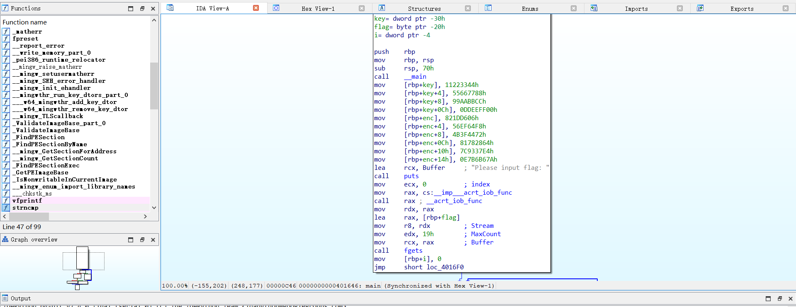
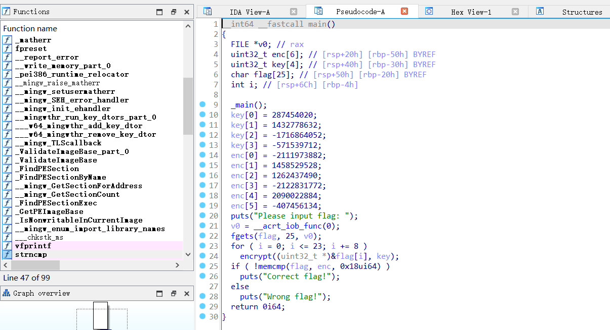

# Reverse-tea加密算法

## 题意
给了一个`tea.exe`的文件，要求进行逆向分析。

## 题解
首先用ida64打开tea.exe文件


利用快捷键F5进行反编译，看到如下代码


代码中给出了4个4字节密钥key，以及6个4字节的密文enc，要求你输入一个字符串flag，flag在密钥key加密后的内容要与enc一致。那么考虑解密enc反向拿到flag明文。

在学习资料当中，给出了什么是Tea加密算法以及Tea的加密和解密函数
```cpp
#include <stdint.h>

void encrypt (uint32_t* v, uint32_t* k) {
    uint32_t v0=v[0], v1=v[1], sum=0, i;           /* set up */
    uint32_t delta=0x9e3779b9;                     /* a key schedule constant */
    uint32_t k0=k[0], k1=k[1], k2=k[2], k3=k[3];   /* cache key */
    for (i=0; i < 32; i++) {                       /* basic cycle start */
        sum += delta;
        v0 += ((v1<<4) + k0) ^ (v1 + sum) ^ ((v1>>5) + k1);
        v1 += ((v0<<4) + k2) ^ (v0 + sum) ^ ((v0>>5) + k3);  
    }                                              /* end cycle */
    v[0]=v0; v[1]=v1;
}

void decrypt (uint32_t* v, uint32_t* k) {
    uint32_t v0=v[0], v1=v[1], sum=0xC6EF3720, i;  /* set up */
    uint32_t delta=0x9e3779b9;                     /* a key schedule constant */
    uint32_t k0=k[0], k1=k[1], k2=k[2], k3=k[3];   /* cache key */
    for (i=0; i<32; i++) {                         /* basic cycle start */
        v1 -= ((v0<<4) + k2) ^ (v0 + sum) ^ ((v0>>5) + k3);
        v0 -= ((v1<<4) + k0) ^ (v1 + sum) ^ ((v1>>5) + k1);
        sum -= delta;                                   
    }                                              /* end cycle */
    v[0]=v0; v[1]=v1;
}
```
在这道题目当中，Tea加密算法最主要的就是它存在一个delta，我们从代码中可以看到这个题目的delta=-1640531527u，解密算法其实就是有点类似加密的逆过程，在这个解密过程当中，我们需要先知道32轮以后的sum值等于多少，然后反向带回去，所以必须要先知道delta的值才能继续往下解密。该加密算法每次加密的是相邻的2个4字节明文。


下面是我写的cpp解密代码(~~略显丑陋~~)：
```cpp
    vector<unsigned int> v = {-2111973882u, 1458529528, 1262437490, -2122831772u, 2090022884, -407456134u};
    vector<unsigned int> k = {287454020, 1432778632, -1716864052u, -571539712u};
    auto decode = [&](int i) {
        unsigned int v0 = v[i], v1 = v[i + 1], sum = 0;
        unsigned int delta = -1640531527u;
        for (int i = 0; i <= 0x1F; i++) {
            sum += delta;
        }
        unsigned int k0 = k[0], k1 = k[1], k2 = k[2], k3 = k[3];
        for (int i = 0; i < 32; i++) {
            v1 -= ((v0 << 4) + k2) ^ (v0 + sum) ^ ((v0 >> 5) + k3);
            v0 -= ((v1 << 4) + k0) ^ (v1 + sum) ^ ((v1 >> 5) + k1);
            sum -= delta;
        }
        v[i] = v0; v[i + 1] = v1;
    };
    for (int i = 0; i < v.size(); i += 2) {
        decode(i);
    }
    for (int i = 0; i < v.size(); i++) {
        for (int j = 0; j < 4; j++) {
            unsigned int x = v[i] % (1 << 8);
            v[i] >>= 8;
            cout << char(x);
        }
    }
```