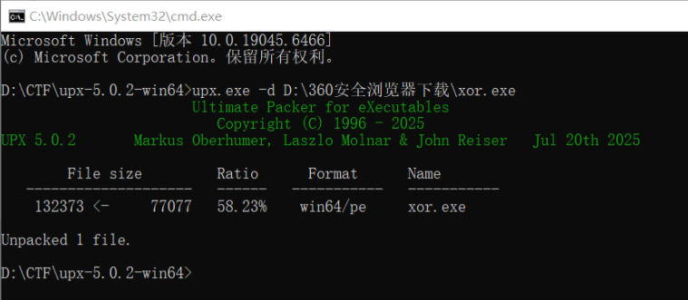
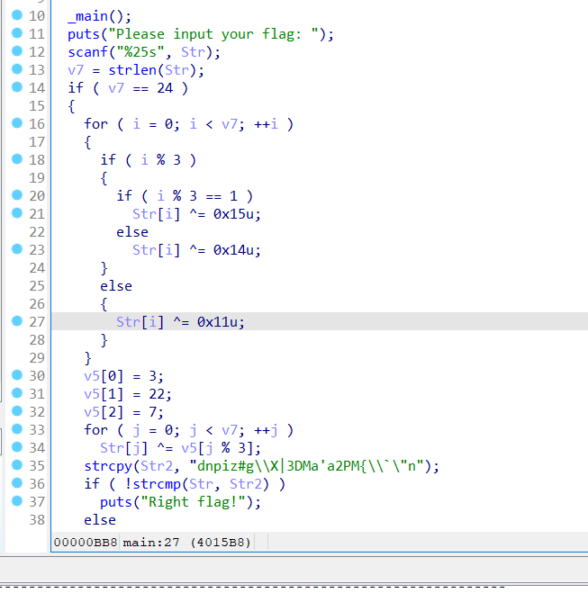

# Reverse-upx壳

## 题目
给了一个`xor.exe`文件，要求进行逆向分析。

## 题解
首先这是一道关于upx壳的问题。


如果直接进行逆向编译，发现很多内容都被略去了
使用[upx-5.0.2](https://github.com/upx/upx/releases/tag/v5.0.2)进行脱壳


然后再进行逆向编译，就可以清晰看到程序的内容。


程序大体意思就是你需要输入一个长度为24的字符串，然后会对你输入的字符串进行一个类似加密运算的过程，最后和`Str2`也就是`"dnpiz#g\\X|3DMa'a2PM{\\`\"n"`进行比较。
那么我们可以尝试把Str2进行解密，就能得到我们的flag，如下是c++的解密代码。
```cpp
    string s = "dnpiz#g\\X|3DMa'a2PM{\\`\"n";
    vector<int> a = {3, 22, 7};
    for (int i = 0; i < s.size(); i++) {
        s[i] ^= a[i % 3];
    }
    for (int i = 0; i < s.size(); i++){
        if (i % 3) {
            if (i % 3 == 1) {
                s[i] ^= 0x15u;
            } else {
                s[i] ^= 0x14u;
            }
        } else {
            s[i] ^= 0x11u;
        }
    }
    cout << s << '\n';
```