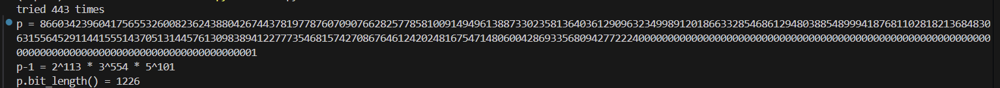
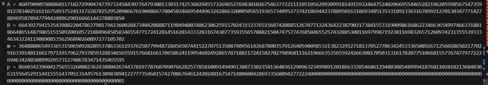
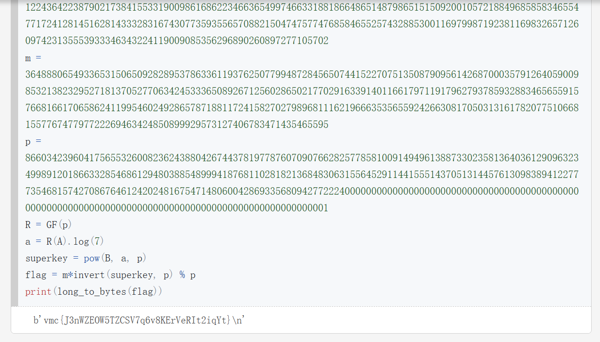

# Crypto-DH密钥交换

## 题意
`tast.py`

## 题解

首先生成一个模数

```python
from Crypto.Util.number import isPrime
import random
def generate_prime_with_factors_of_2_3_5(bits=1024):
    count = 0
    while True:
        count += 1
        print(f'[{count}]', end='\r')
        # 随机选择a, b, c的值来生成p-1，使得p有足够的位数
        a = random.randint(100, 1000)  # 控制2的指数
        b = random.randint(100, 700)   # 控制3的指数
        c = random.randint(100, 500)   # 控制5的指数
        p_minus_1 = (2 ** a) * (3 ** b) * (5**c)
        p = p_minus_1 + 1
        if p.bit_length() >= bits and isPrime(p):
            print(f"tried {count} times")
            return p, a, b, c
# 生成一个至少1024位的素数p，满足p-1的质因数仅为2, 3, 5
p, a, b, c = generate_prime_with_factors_of_2_3_5()
print(f"p = {p}")
print(f"p-1 = 2^{a} * 3^{b} * 5^{c}")
print(f"p.bit_length() = {p.bit_length()}")
```

然后利用我们的模数，连接到服务器得到Alice、Bob的公钥和密文的消息

```python
from Crypto.Util.number import isPrime
import random
def generate_prime_with_factors_of_2_3_5(bits=1024):
    count = 0
    while True:
        count += 1
        print(f'[{count}]', end='\r')
        # 随机选择a, b, c的值来生成p-1，使得p有足够的位数
        a = random.randint(100, 1000)  # 控制2的指数
        b = random.randint(100, 700)   # 控制3的指数
        c = random.randint(100, 500)   # 控制5的指数
        p_minus_1 = (2 ** a) * (3 ** b) * (5**c)
        p = p_minus_1 + 1
        if p.bit_length() >= bits and isPrime(p):
            print(f"tried {count} times")
            return p, a, b, c
# 生成一个至少1024位的素数p，满足p-1的质因数仅为2, 3, 5
p, a, b, c = generate_prime_with_factors_of_2_3_5()
print(f"p = {p}")
print(f"p-1 = 2^{a} * 3^{b} * 5^{c}")
print(f"p.bit_length() = {p.bit_length()}")
```

最后通过[SageMath](https://cocalc.com/features/sage)平台求出明文，该明文可能会出现乱码，
可以通过多尝试几组不同的p来生成

```python
from Crypto.Util.number import long_to_bytes
from gmpy2 import invert
A = 460790905508860117182729904747797324584307764793001330317425360294557326965276983010267546377221111051056299209918149159324647524020669554465282196205598567547359812783402516116754937524131722878252952098667619048667780450246695444963242866320005056519365734095273742186944237889501631869348513533189133631678992127013034777142788969587894779442489629016666144378803850
B = 664392794153543988220478637981794236002847340420888711984940074862306259157024315237651568742088512670771224364223879021738415533190098616862234663654997466331881866486514879865151509200105721884968585834655477172412814516281433328316743077359355657088215047475774768584655257432885300116979987192381169832657126097423135553933346343224119009085356296890260897277105702
m = 364888065493365315065092828953786336119376250779948728456507441522707513508790956142687000357912640590098532138232952718137052770634245333650892671256028650217702916339140116617971191796279378593288346565591576681661706586241199546024928657871881172415827027989681116219666353565592426630817050313161782077510668155776747797722269463424850899929573127406783471435465595
p = 866034239604175655326008236243880426744378197787607090766282577858100914949613887330235813640361290963234998912018663328546861294803885489994187681102818213684830631556452911441555143705131445761309838941227773546815742708676461242024816754714806004286933568094277222400000000000000000000000000000000000000000000000000000000000000000000000000000000000000000000000000001
R = GF(p)
a = R(A).log(7)
superkey = pow(B, a, p)
flag = m*invert(superkey, p) % p
print(long_to_bytes(flag))
```
