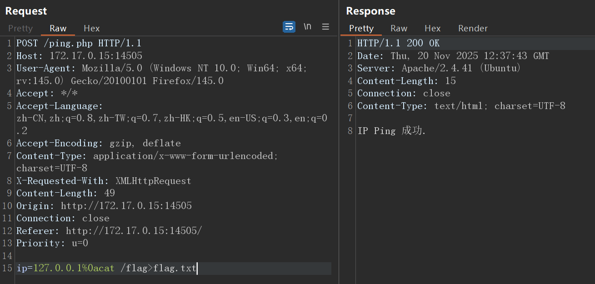

# Web-远程命令执行漏洞

## 题目

在空白中输入ip地址，在Result中会返回ping没ping通，或者是否存在恶意字符。

## 题解
首先根据`远程命令执行漏洞`的一些资料尝试手玩一下，有了如下发现，其中只要有恶意字符露头就秒，没有打马赛克的是可以直接输入的字符，只能尝试其他方法。


然后发现在网页里输入的长度限制在15，直接在burp抓包里开始尝试，发现根本不限制输入长度。然后通过开挂，可以直接通过拼接以下payload，然后直接访问就可看到flag。
```
127.0.0.1%0acat /flag>flag.txt
```



这个问题当中，需要构造payload去执行代码，`%0a`指的是`\n`换行符，在一开始尝试的时候确实没想到手玩一下非打印字符~~彩笔是这样~~。